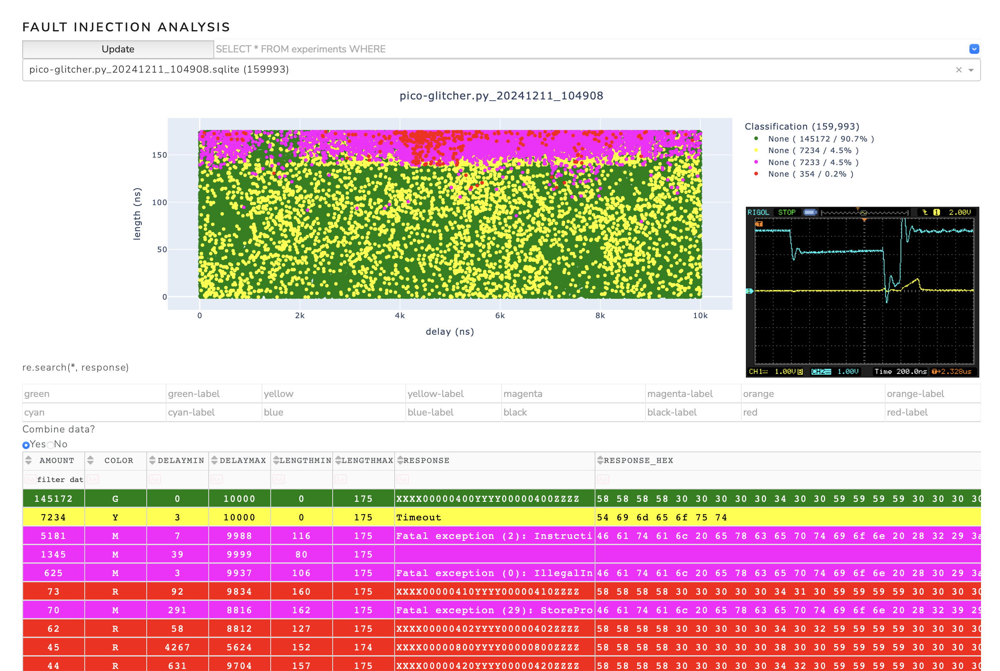

# Genetic Algorithm

In some cases, finding the parameters of a successful glitch can be quite tedious.
Especially if the possible parameter space is large (see [multiplexing](multiplexing.md) and [pulse-shaping](pulse_shaping.md)).
Therefore, the search for a suitable parameter point must be somewhat more intelligent than a brute force approach.

In the case of `findus`, a genetic algorithm has been implemented that can be used to search for the optimum parameter points.

The use of this genetic algorithm will be briefly outlined below. For a detailed view into how to use this algorithm in the context of voltage glitching, see for example `projects/esp32v1.3-glitching`.

## Implementing a genetic search algorithm when glitching

Import the class `OptimizationController` into your project:

```python
from findus import OptimizationController
```

Since the genetic algorithm needs to classify the outcome of each bin with a numerical value (the so-called `weight`), a classify-method with additional weight factors must be implemented.
These weights are fed into the genetic algorithm.
```python
def classify(self, response):
    if b'read-out protection enabled\r\n' in response:
        color, weight = 'G', 0
    elif b'' == response:
        color, weight = 'M', 0
    elif b'Error' in response:
        color, weight = 'M', 0
    elif b'Fatal exception' in response:
        color, weight = 'M', 0
    elif b'Timeout' in response:
        color, weight = 'Y', -1
    else:
        color, weight = 'R', 2
    return color, weight
```

After initializing the glitcher, the parameter space must be defined. This is done by defining the parameter space boundaries, and the corresponding divisions into bins:
```python
# Genetic Algorithm to search for the best performing bin
boundaries = [(s_delay, e_delay), (s_t1, e_t1), (s_length, e_length)]
divisions = [10, 10, 5]
opt = OptimizationController(parameter_boundaries=boundaries, parameter_divisions=divisions, number_of_individuals=10, length_of_genom=20, malus_factor_for_equal_bins
=1)
```

In the while-loop after the experiment was performed, the best performing bins can be monitored from time to time. Also the glitch outcome must be classified and fed into the genetic algorithm again.
```python
# get the next parameter set
delay, t1, length = opt.step()
if experiment_id % 100 == 0:
    opt.print_best_performing_bins()

# perform arming, triggering, read response
[...]

# classify response
color, weight = glitcher.classify(response)

# add experiment to parameterspace of genetic algorithm
opt.add_experiment(weight, delay, t1, length)
```

If implemented correctly (and with a suitable configuration of the `OptimizationController`) you should expect clustering experiments around successful glitches. See the figure below for an example output of a glitching campaign.



Note that the implementation of the genetic algorithm is not specific to the Pico Glitcher and can therefore also be used by the ChipWhisperer Pro and Husky.