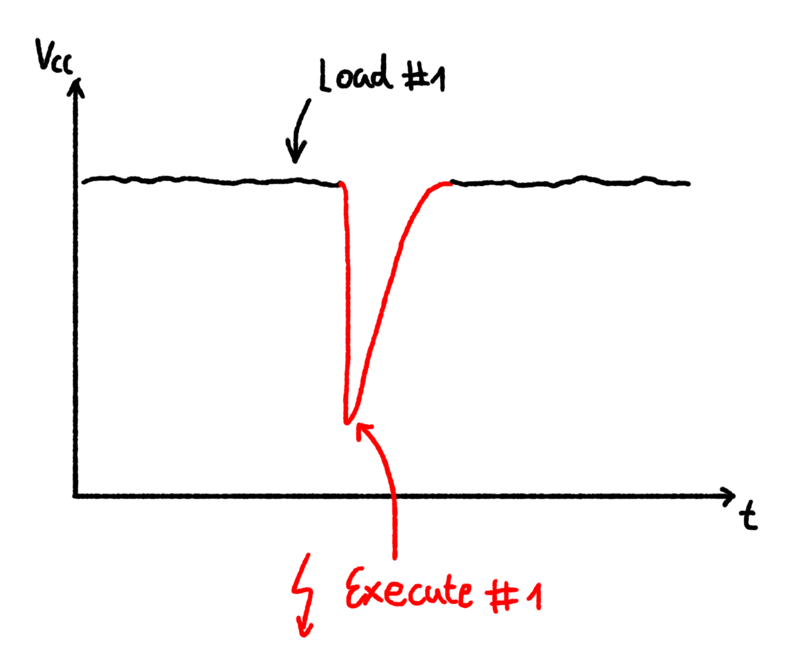

# Overview

This page will give a brief overview of what findus (aka the fault-injection-library) and the PicoGlitcher is, what it can be used for and where to go from here.

## Fault-Injection

Fault injection is a group of attacks in which external influences are used to cause faults in a system and thereby influence the behavior of the system. In the simplest case, this can be an input mask on a web application that is not correctly secured against incorrect input. However, fault injection attacks usually also involve some kind of side-channel attack. This means that the fault is not caused by the usual channels (e.g. the input screen on the web application), but by a second channel. In the case of microcontrollers or embedded systems in general, the power supply or the clock generators on the board are used as a side channel to provoke error states.

## Voltage Glitching

In voltage glitching, the voltage supply to the chip is reduced for a very short time (in the order of nanoseconds to a few microseconds) to such an extent that processes in the chip no longer function correctly. Energy is required for certain operations in the chip. If this energy is not available, the operation is not carried out or is carried out incorrectly. Writing or erasing a memory cell, for example, cannot take place if there is not enough energy (i.e. in the simplest case, the supply voltage) available.

If the power supply is reduced at the time when a CPU register is written, no data or an incorrect value is written to the register. This can be particularly useful as an attack vector if the microcontroller has read-out protection. With read-out protection, the flash content is protected by checking if certain register values are set. These register values are not usually located in the firmware on the flash, but in a separate memory area, so-called fuses. If the microcontroller wants to check whether the read-out protection is set, these fuses must be read out and copied to an internal CPU register. If the power supply is lowered during this copying process so that the internal CPU register is written to incorrectly, the read-out protection can potentially be bypassed.

The parameters for such attacks are the time delay from a trigger condition to the glitch itself ("delay") and the duration of the glitch ("length"). The trigger condition can be anything, for example switching on the power supply, removing the reset signal or certain states in the data transmission.

## What is findus?

Findus (aka the fault-injection-library) is a toolchain to perform fault-injection attacks on microcontrollers and other targets.
This library offers an easy entry point to carry out fault-injection attacks against microcontrollers, SoCs and CPUs.
With the provided and easy to use functions and classes, fault-injection projects can be realized quickly with cheap and available hardware.

Findus supports the [ChipWhisperer Pro](https://rtfm.newae.com/Capture/ChipWhisperer-Pro/), the [ChipWhisperer Husky](https://rtfm.newae.com/Capture/ChipWhisperer-Husky/) and the PicoGlitcher.
More information about the ChipWhisperer Pro and the ChipWhisperer Husky can be found on [https://chipwhisperer.readthedocs.io/en/latest/index.html](https://chipwhisperer.readthedocs.io/en/latest/index.html).

## What is the Pico Glitcher?

The Pico Glitcher is a device similar to the [ChipWhisperer Pro](https://rtfm.newae.com/Capture/ChipWhisperer-Pro/) and the [ChipWhisperer Husky](https://rtfm.newae.com/Capture/ChipWhisperer-Husky/).
The Pico Glitcher is capable of generating voltage glitches very precisely. It also has several options for trigger generation, i.e. the Pico Glitcher can trigger on rising or falling edges, or even on patterns in a data transmission (for example on a specific UART word).

The hardware is based on the [Raspberry Pi Pico](https://www.raspberrypi.com/products/raspberry-pi-pico/), a low-power and a high-power MOSFET for glitch generation and other components for power supply. Level shifters ensure that the Pico Glitcher can handle a wide range of reference voltages, i.e. the Pico Glitcher is not limited to a fixed logic level.

Three tapping points are available for reference voltages: 1.8V, 3.3V and 5V. These can be used to supply the target or to provide reference voltages for external circuits. The voltage on the 'VTARGET' pin header can be switched on and off via the findus library, which is useful for performing a hard reset on the target (power-cycle). The 'VTARGET' pinouts can also be supplied by an external power supply unit. To do this, the 'JMP_VCC_INTERN' jumper must be removed. The external power supply is then applied to the 'VCC_EXTERN' pin.

An additional pin header is connected to the remaining GPIO pins of the Raspberry Pi Pico via level shifters. These can be programmed for further inputs and outputs as required. For example, further triggers can be created on these pin headers or protocol translators can be implemented.

Glitches are generated by two crowbar transistors. A 'IRLML2502' MOSFET is used for generating low-power glitches, the second 'SI4134DY' MOSFET can switch up to 50 Amperes. Depending on the application, one or the other transistor may be suitable. The transistors can be selected via the findus library. For most applications, the low-power MOSFET is sufficient and even generates sharper glitches (with steeper edges) than the high-power MOSFET. However, if larger currents need to be dissipated, for example if large capacitors are installed on the target, the high-power MOSFET is the better choice.

Status LEDs also indicate the current status of the board: Whether the target voltage is being generated, whether the glitcher is armed, or whether a trigger signal is present, etc.

Continue reading [getting started](getting_started.md) to learn more about how to set up your Pico Glitcher.

## Components

