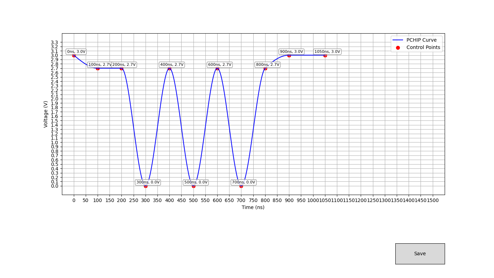
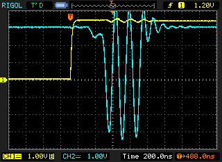
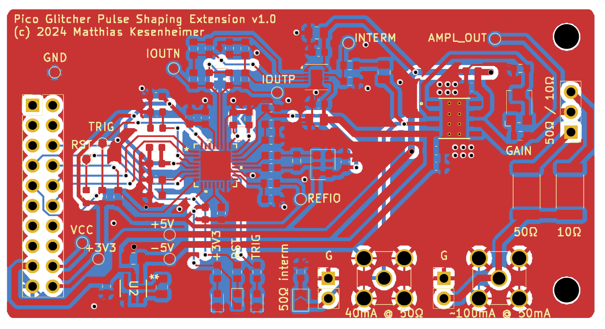

# Pulse-Shaping

As described previously in section [comparing different glitching modes](glitches.md), pulse-shaping is the method of generating arbitrary voltage profiles that are appplied to the power rail of the target device.

This method was introduced to the Pico Glitcher v2 with a special expansion board and is described briefly in the following.

## Pulse-shaping test setup

The following test setup can be used to test the pulse-shaping expansion board of the Pico Glitcher v2:


## Using the pulse-shaping stage

```python
from findus import PicoGlitcher

glitcher = PicoGlitcher()
glitcher.init(port='/dev/ttyACM0')

glitcher.rising_edge_trigger()

# choose pulse-form glitching
glitcher.set_pulseshaping(vinit=3.3)
```

```python
tpoints = [  0,  20, 40,  60,  80]
vpoints = [3.3, 2.7,  0, 2.7, 3.3]
glitcher.arm_pulseshaping_from_spline(delay, tpoints, vpoints)
```

## Other examples
See `fault-injection-library/example/pico-glitcher-pulse-shaping.py`:

```python
# pulse shaping with config (without interpolation, like multiplexing)
ps_config = [[length, 2.0], [length, 1.0], [length, 0.0], [length, 3.3]]
glitcher.arm_pulseshaping_from_config(delay, ps_config)
```
--- TODO: picture of pulse ---

```python
# pulse from lambda
ps_lambda = f"lambda t:2.0 if t<{length} else 1.0 if t<{2*length} else 0.0 if t<{3*length} else 3.0"
glitcher.arm_pulseshaping_from_lambda(delay, ps_lambda, 10*length)
```
--- TODO: picture of pulse ---

```python
# pulse from lambda; ramp down to 1.8V than GND glitch
ps_lambda = f"lambda t:-1.0/({2*length})*t+3.0 if t<{2*length} else 2.0 if t<{4*length} else 0.0 if t<{5*length} else 3.0"
glitcher.arm_pulseshaping_from_lambda(delay, ps_lambda, 6*length)
```
--- TODO: picture of pulse ---

```python
# pulse from raw list
pulse = [-0x1fff] * 50 + [-0x0fff] * 50 + [-0x07ff] * 50 + [0x0000] * 50
glitcher.arm_pulseshaping_from_list(delay, pulse)
```
--- TODO: picture of pulse ---

```python
# pulse from predefined; ramp down to 1.8V than GND glitch
calculate_constant = True
[...]

if calculate_constant:
        # send full config first time
        ps_config = {"psid": 1, "vstart": 3.0, "tramp": length, "vstep": 2.0, "tstep": length, "length": length, "vend": 3.0}
        glitcher.arm_pulseshaping_from_predefined(delay, ps_config, calculate_constant)
        calculate_constant = False
    else:
        # only update relevant parameters next time
        ps_config = {"psid": 1, "length": length, "vend": 3.0}
        glitcher.arm_pulseshaping_from_predefined(delay, ps_config)
```
--- TODO: picture of pulse ---

```python
xpoints = [0,   100, 200, 300, 400, 500, 515, 520]
ypoints = [3.0, 2.1, 2.0, 2.0, 1.7, 0.0, 2.0, 3.0]
glitcher.arm_pulseshaping_from_spline(delay, xpoints, ypoints)
```
--- TODO: picture of pulse ---

## Plotting requested pulses in real time

```python
from findus.firmware.Spline import Spline
[...]

xpoints = [0,   100, 200, 300, 400, 500, 515, 520]
ypoints = [3.0, 2.1, 2.0, 2.0, 1.7, 0.0, 2.0, 3.0]
glitcher.arm_pulseshaping_from_spline(delay, xpoints, ypoints)
Spline.interpolate_and_plot(xpoints, ypoints)
```
--- TODO: picture of actual pulse and requested pulse ---

## Calibration

--- TODO: make calibration script available as cli tool ---
```python
calibrate
```

## Interactive PCHIP Editor




```python
from findus.InteractivePchipEditor import InteractivePchipEditor
editor = InteractivePchipEditor()
[...]

editor.show(block=False)
xpoints, ypoints = editor.get_points()
glitcher.arm_pulseshaping_from_spline(delay, xpoints, ypoints)
```

## Technical details

The waveform generator AD9102 from Analog devices was chosen and is used to generate arbitrary voltage profiles.
This chip is a high performance digital-to-analog converter (DAC) integrating on-chip pattern memory for complex waveform generation with a direct digital synthesizer (DDS).
The key features of the chip are:

- On-chip 4096 × 14-bit pattern memory
- 180 MSPS pattern generator
- SPI interface to connect to the Pico Glitcher v2


The following circuit is used for the Pico-Glitcher v2 expansion board to amplify the signals from the DDS:


The requirements to the power amplifier are as follows:

- High slew rate for clean and steep signals: >7000 V/μs.
- Wide bandwidth of up to 200MHz.
- High output current to supply the target with power: >±200 mA


